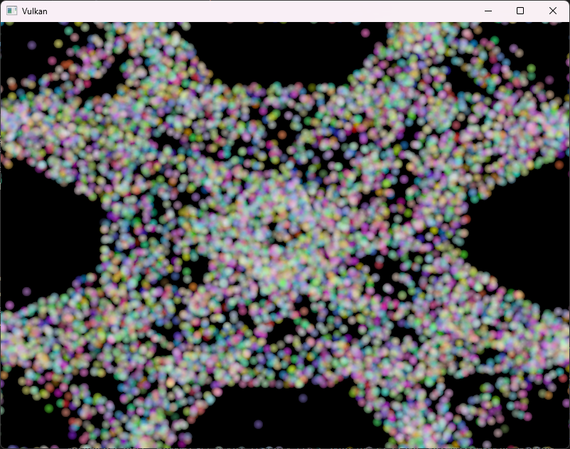

VSCode CMake
====
当前学习环境已搭建好，下载之后直接在VScode中直接CMAKE便可进行开发调试

Vulkan tutorial
===============

This repository hosts the contents of [vulkan-tutorial.com](https://vulkan-tutorial.com).
The website itself is based on [daux.io](https://github.com/dauxio/daux.io),
which supports [GitHub flavored Markdown](https://help.github.com/articles/basic-writing-and-formatting-syntax/).
The actual site runs daux.io with a custom theme and a few modifications (https://github.com/Overv/daux.io) and this is built into a [Docker image](https://hub.docker.com/r/overv/vulkan-tutorial).

Use issues and pull requests to provide feedback related to the website. If you
have a problem with your code, then use the comments section in the related
chapter to ask a question. Please provide your operating system, graphics card,
driver version, source code, expected behaviour and actual behaviour.

E-book
------

This guide is now available in e-book formats as well:

* EPUB ([English](https://vulkan-tutorial.com/resources/vulkan_tutorial_en.epub), [French](https://vulkan-tutorial.com/resources/vulkan_tutorial_fr.epub))
* PDF ([English](https://vulkan-tutorial.com/resources/vulkan_tutorial_en.pdf), [French](https://vulkan-tutorial.com/resources/vulkan_tutorial_fr.pdf))

The e-book can be built from the existing content by running:

     python3 build_ebook.py

This script depends on the following utilities being available on the path:

* `inkscape`: SVG to PNG conversion (tested with version 1.0.2)
* `pandoc`: Building a PDF and EPUB from the Markdown code (tested with version 2.13)

You also need to install a LaTeX distribution for PDF generation.

Changing code across chapters
-----------------------------

It is sometimes necessary to change code that is reused across many chapters,
for example a function like `createBuffer`. If you make such a change, then you
should update the code files using the following steps:

* Update any chapters that reference the modified code.
* Make a copy of the first file that uses it and modify the code there, e.g.
`base_code_fixed.cpp`.
* Create a patch using
`diff -Naur base_code.cpp base_code_fixed.cpp > patch.txt`.
* Apply the patch to the specified code file and all files in later chapters
using the `incremental_patch.sh` script. Run it like this:
`./incremental_patch.sh base_code.cpp patch.txt`.
* Clean up the `base_code_fixed.cpp` and `patch.txt` files.
* Commit.

Rendering the tutorial
-----------------------------

To render the tutorial (i.e. convert the markdown to html), you have two options:

1. Serve rendered files on the fly using a web server that has php installed
2. Generate static html files that you can view locally or put on a server

For either of these options, you'll need php and a patch'ed daux.

### PHP

1. Make sure [PHP](http://php.net/downloads.php) is installed (Daux is written
   in PHP)
    1. Both the `php_mbstring` and `php_openssl` extensions need to be enabled
    2. The `phar.readonly` setting needs to be set to `Off` (to be able to
       rebuild Daux)
2. Make sure [Composer](https://getcomposer.org/) is installed, a php dependency
   manager that Daux uses

### Clone, patch, and rebuild daux

1. Clone [daux](https://github.com/dauxio/daux.io)
    * `git clone https://github.com/dauxio/daux.io.git`
2. Make a new branch at the older revision that the VulkanTutorial patch is
   against:
    * `git checkout d45ccff -b vtpatch`
    * Making a new branch isn't strictly necessary, as you could reset `master`,
      but this keeps master intact.
3. Copy over the `daux.patch` file into the daux.io directory, make sure line
   endings are UNIX style (in case you're using Windows), and apply the patch.
   It should apply cleanly.
    * `git am daux.patch`
4. Run composer in the daux.io directory so that it downloads the dependencies
   Daux needs in order to be built
    * `composer install`
5. Rebuild Daux
    * `php bin/compile` (this can take a while)
    * A newly made `daux.phar` will now be in your base directory

### Using Daux to serve rendered files on the fly

Once you've completed the above, follow the instructions on the daux site
for how to [run daux using a web server](https://github.com/dauxio/daux.io/blob/master/README.md#running-remotely).

As a simple option considering you have php installed, you can also use php's
built in development web server if you just need to locally see what things
look like:

1. In the `daux.io` directory, edit `global.json` so that the `docs_directory`
   option points at your VulkanTutorial directory
    * `"docs_directory": "../VulkanTutorial",`
2. In the `daux.io` directory, run
    * ` php -S localhost:8080 index.php`
3. Type `localhost:8080` in your web browser URL bar and hit enter. You should
   now see the VulkanTutorial front page.

### Using Daux to statically generate html files

Before we generate the static files, we need to tweak daux and the tutorial
setup to prevent it from trying to load a few outside resources (which will
stall your browser when trying to load the otherwise static page)

1. In the `VulkanTutorial` directory, edit `config.json` and remove the
   `google_analytics` line so daux doesn't try to load that.
2. In the `daux.io` directory, edit `themes/daux/config.json` and remove the
   `font` line so that daux doesn't try to load an external font.
3. Rebuild daux according to the earlier instructions so it picks up the theme
   changes.

We're working on improvements so in the future the above steps won't be
necessary.

Now with the above done, we can generate the static files. Asuming the daux.io
and VulkanTutorial directories are next to each other, go into the `daux.io`
directory and run a command similar to:
`php generate -s ../VulkanTutorial -d ../VulkanTutorial/out`.

`-s` tells it where to find the documentation, while `-d` tells it where to put
the generated files.

Note: if you want to generate the docs again, delete the `out` directory first
or daux will make a new `out` directory within the existing `out` directory.

License
-------

The contents of this repository are licensed as [CC BY-SA 4.0](https://creativecommons.org/licenses/by-sa/4.0/),
unless stated otherwise. By contributing to this repository, you agree to license
your contributions to the public under that same license.

The code listings in the `code` directory are licensed as [CC0 1.0 Universal](https://creativecommons.org/publicdomain/zero/1.0/).
By contributing to that directory, you agree to license your contributions to
the public under that same public domain-like license.
